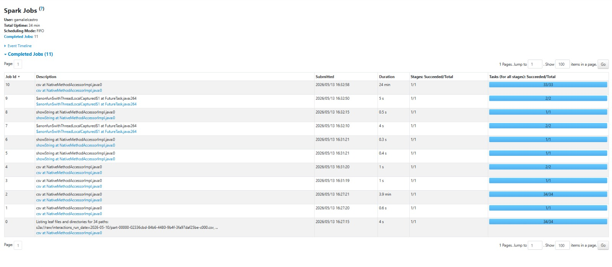
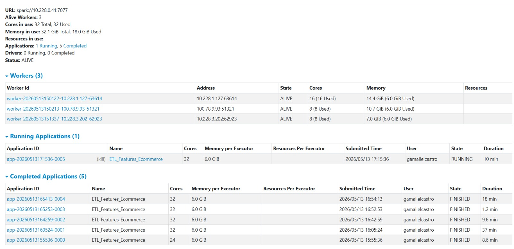

# Reporte de Implementación: Fase 1 (ETL Distribuido)

**Proyecto:** Sistema de Recomendaciones E-commerce (Batch Inference)

**Estatus:** FINALIZADO CON ÉXITO

**Fecha de Ejecución:** 13 de Mayo de 2026

---

## 1. Topología Final del Clúster (Red Local)

El procesamiento se ejecutó en un clúster **Spark Standalone** de 4 nodos con las siguientes especificaciones validadas:

| Nodo | Rol | IP | Hardware |
| --- | --- | --- | --- |
| **Blanca** | Master & Data Lake | `10.228.0.41` | Gestión de recursos y MinIO |
| **Evans** | Worker 1 | `10.228.1.127` | 16 Cores / 14.4 GiB RAM |
| **Ghael** | Worker 2 | `100.78.9.93` | 8 Cores / 10.7 GiB RAM |
| **Gamaliel** | Worker 3 | `10.228.3.202` | 8 Cores / 7.0 GiB RAM |

**Potencia Total:** 32 Cores distribuidos | **~32 GiB RAM** efectiva para ejecución.
---

## 2. Parámetros y Lógica del ETL

El flujo de ingeniería de datos se conectó al bucket `raw` mediante el protocolo **S3A**.

* **Transformaciones Críticas:**
* Cálculo de **rating implícito** (escala 0-1).
* Aplicación de **decay temporal** para priorizar eventos recientes.


* **Filtros de Negocio:** Cruce con catálogo para exclusión de productos sin stock o inactivos.
* **Esquema de Salida:** `user_id`, `item_id`, `score`, `price`, `stock`, `category`, `run_date`.

---

## 3. Métricas de Ejecución (Benchmarking)

Resumen del rendimiento del App ID: `app-20260513172706-0006`.

* **Volumen de Entrada:** 175,000,000 interacciones (2.8 GiB).
* **Volumen de Salida:** 5.4 GiB de features estructurados.
* **Tiempo de Ejecución:** 44 minutos.
* **Destino:** Escritura particionada en 23 archivos `.csv` en el bucket `features/` de MinIO.


---

## 4. Auditoría de Calidad de Datos (QA)

Validación de integridad sobre el dataset resultante:

* **Integridad:** 0 valores nulos en columnas clave.
* **Reglas de Negocio:**
* Score Mínimo: **0.0950**
* Score Máximo: **0.6300**
* Condición `Score > 0` cumplida al 100%.


> [!IMPORTANT]
> **Veredicto:** Dataset **APROBADO** para el entrenamiento del modelo ALS en la Fase 2.

---

## 5. Guía de Reproducibilidad

Para replicar el proceso en el entorno local:

1. Levantar **MinIO** en el nodo Master y configurar credenciales en `spark-defaults.conf`.
2. Registrar los Workers contra el Master: `10.228.0.41:7077`.
3. Ejecutar el job:

```bash
spark-submit \
  --master spark://10.228.0.41:7077 \
  src/etl.py \
  --run_date "2026-05-13"

```